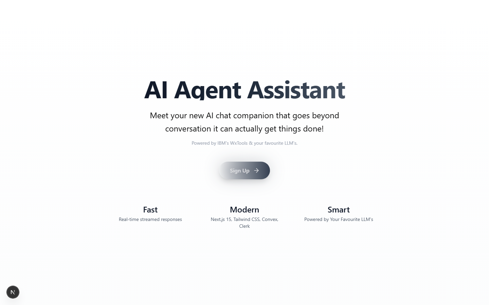
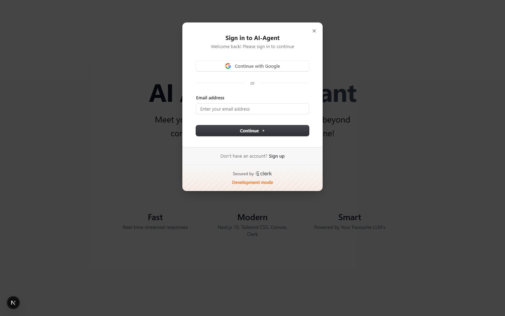

# Commerce Insights Agent

An AI-powered analytics and automation assistant for e-commerce and digital marketing teams. It connects a conversational LangGraph agent to the platforms marketers actually work in — Shopify, Meta Ads, Google Ads, Google Analytics, Google Search Console, and SEMrush — so users can ask questions in plain language and get answers pulled live from those systems.

## Screenshots

| Landing page | Sign in |
|---|---|
|  |  |

The dashboard and chat views sit behind Clerk authentication, so they aren't captured here — connect your own Clerk/Convex/API keys and sign in locally to see them (`npm run dev`, then visit `/dashboard`).

## What it does

- **Conversational agent** built with LangChain/LangGraph, backed by Anthropic and OpenAI models, that decides which tool to call based on the user's question
- **Tool-calling integrations**:
  - **Shopify** — look up orders, products, and customer details without leaving the chat
  - **Meta Ads** — pull campaign/ad-set/ad performance and check which ads are currently active
  - **Google Ads** — campaign performance and account-level reporting
  - **Google Analytics** — traffic and behavior metrics
  - **Google Search Console** — search performance and indexing data
  - **SEMrush** — competitive/SEO metrics
- **Media tools** — transcribe audio/video (Whisper) and analyze uploaded documents/files
- **Chat history & persistence** via Convex, so conversations survive a refresh
- **Authentication** via Clerk, including OAuth connect flows for the ad/analytics accounts above
- **Vector search** via Pinecone for retrieval-augmented context on longer documents

## Tech stack

| Layer | Tech |
|---|---|
| Framework | Next.js 15 (App Router, Turbopack) |
| Agent orchestration | LangChain / LangGraph |
| Models | Anthropic Claude, OpenAI |
| Database / real-time | Convex |
| Auth | Clerk |
| Vector store | Pinecone |
| UI | React 19, Tailwind CSS, Radix UI |

## Getting started

```bash
npm install
npm run dev
```

Open [http://localhost:3000](http://localhost:3000) to view the app.

You'll need API credentials for the services you want to connect (Anthropic/OpenAI, Convex, Clerk, Pinecone, and any of the ad/analytics platforms above) configured as environment variables — see `.env.local` (not committed).

## Project structure
```
app/            Next.js routes (dashboard, chat, auth callbacks, API routes)
lib/tools/      Tool implementations the agent can call (Shopify, Meta, Google Ads, etc.)
lib/langgraph.ts  Agent graph definition
convex/         Convex schema and functions (chats, messages)
components/     UI components
```
